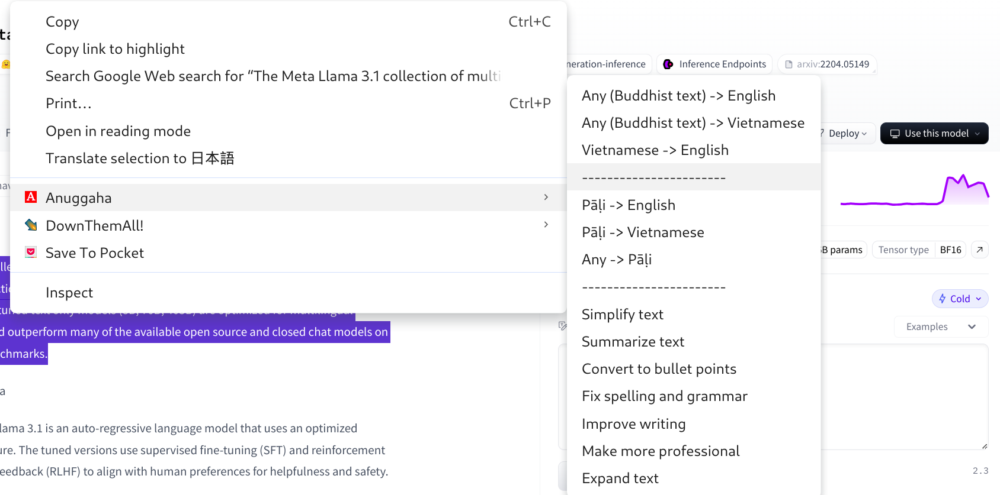

# Anuggaha tool
This is a folk of [scramble](https://github.com/zlwaterfield/scramble), but modified to work with Google AI Studio API.

It leverages Google AI Studio power to translate or enhance text using customized prompts.

> The processed output may **not** always be accurate. Use this tool wisely.

## Installation

1. Clone this repository or [download](https://github.com/vpnry/anuggaha/archive/refs/heads/main.zip) and **unzip** the source code. 
2. Open Chrome and go to `chrome://extensions/`
3. Enable "Developer mode" in the top right
4. Click "Load unpacked" and select the extension directory
5. API Key: This extension **requires** an Google AI Studio key to function. You need to provide your own API key in the extension settings. If you do not have an Google AI Studio API key, get one via [https://aistudio.google.com/app/apikey](https://aistudio.google.com/app/apikey) (currently I am using a free one.)

## Usage

1. Highlight text on any webpage
2. Right-click to open the context menu
3. Select "Anuggaha" and choose a text enhancement option
4. Wait for the AI to process and enhance your text

## License 

- `GoogleGenerativeAI.mjs` is downloaded from https://cdn.jsdelivr.net/npm/@google/generative-ai@0.20.0/dist/index.mjs, see LICENSE inside the code
  
- `scramble` [MIT License](LICENSE)

